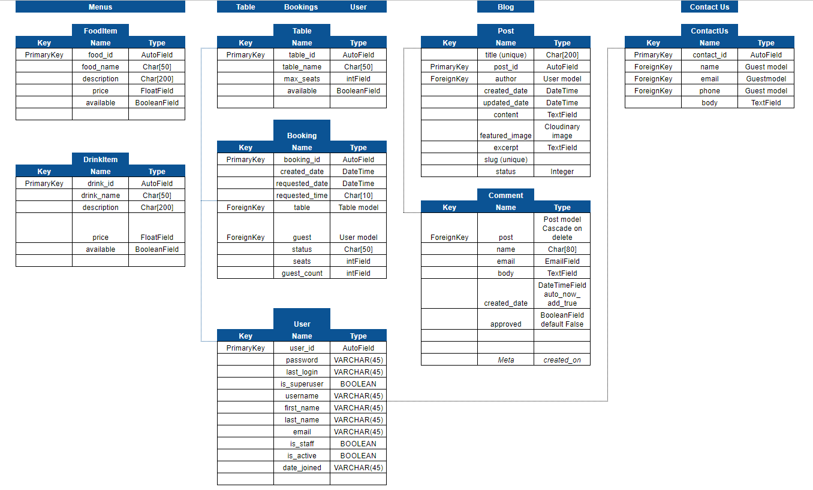

# The Diplomat | Bar & Grill

**Developer: Arron Beale**

💻 [Visit live website](https://ci-pp4-the-diplomat.herokuapp.com/)

## Table of Contents
  - [About](#about)
  - [User Goals](#user-goals)
  - [Site Owner Goals](#site-owner-goals)
  - [User Experience](#user-experience)
  - [User Stories](#user-stories)
  - [Design](#design)
    - [Colours](#colours)
    - [Fonts](#fonts)
    - [Structure](#structure)
      - [Website pages](#website-pages)
      - [Database](#database)
    - [Wireframes](#wireframes)
  - [Technologies Used](#technologies-used)
  - [Features](#features)
  - [Validation](#validation)
  - [Testing](#testing)
    - [Manual testing](#manual-testing)
    - [Automated testing](#automated-testing)
    - [tests on various devices](#tests-on-various-devices)
    - [Browser compatibility](#browser-compatibility)
  - [Bugs](#bugs)
  - [Heroku Deployment](#heroku-deployment)
  - [Credits](#credits)
  - [Acknowledgements](#acknowledgements)

### About

The Diplomat Bar & Grill is a fictional business where users can create an account, book a table, read a blog and view the food and drinks menu.

### User Goals

- To create a table booking
- To be able to view edit and cancel bookings
- To view menus, a blog and contact info

### Site Owner Goals

- To provide a solution to allow users to book a table online
- To attract more business with a well crafted site
- Provide a modern application with an easy navigation
- Fully responsive and accessible

## User Experience

### Target Audience
- Users that wish to book a table for a meal or a party with family and friends
- Past and new customers for the business
- Tourists visiting the area that are looking for a meal or a drink or both
- Fans visiting the area for a sports event or a music concert
- People employed in the area to eat and drink after work

### User Requirements and Expectations

- Fully responsive
- Accessible
- 
- A welcoming design
- Social media
- Contact information
- Accessibility

##### Back to [top](#table-of-contents)

## User Stories

### Users

1.	As a User, I can 
2.	As a User, I can 
3.	As a User, I can 
4.	As a User, I can 
5.	As a User, I can 
6.	As a User, I can 
7.	As a User, I can 
8.	As a User, I can 
9.	As a User, I can 
10. As a User, I can 
11. As a User, I can 
12. As a User, I can 
13. As a User, I can 
14. As a User, I can 

### Site Owner
11.	
12.	
13.	
14.	
15.	
16.	
17.	
18.	

##### Back to [top](#table-of-contents)

## Design

### Colours

I chose dark colors to keep a theme of a dimly lit room as seen in a lot of espionage movies.
Dark themes are popular so I wanted to keep the site on a dark theme and not overly bright.

The colors I wanted to stay close to  [Coolors.co](https://coolors.co/)

See colour pallet

### Fonts

 Fonts here

### Structure

#### Website pages

Decsription here

Expand on details

- The site consists of the following pages:
  - Homepage
  - Food menu
  - Drinks menu
  - Blog
  - Blog expanded
  - Book
  - My bookings
  - Edit booking
  - Cancel bookin
  - Contact us
  - Login / Logout
  - Register
  - 404 error page.

#### Database

- Python built with the Django framework with a database of a Postgres for the deployed Heroku version(production)
- Two database model shows all the fields stored in the database

Show diagram

##### User Model
- The User model contains information about the user. It is part of the Django allauth library

##### Model
- The WorkoutPlan model contains the following fields: first_day and User
- The model has a one-to-one relationship with User

##### Model
- The WorkoutTime model contains the workout_time_name field
- The model contains information about the workout time (AM or PM)

##### Model
- The Workout model contains the following fields: workout_name, workout_time, workout_plan and day
- It contains WorkoutTime as a foreign key
- It contains WorkoutPlan as a foreign key
- The day field contains the date of week for the plan

##### Model
- The Exercise model contains the following fields: name, description, body_part, type, equipment, level and image
- The model represents an exercise and its details
- The name fields contains the exercise name
- The description field contains exercise description
- It contains BodyPart as a foreign-key
- It contains Type as a foreign key
- It contains Level as a foreign key
- The image field contains the exercise image

##### Model
- The model contains the body type category for an exercise
- The model contains the following fields: part

##### Model
- The model contains the type of an exercise
- The model contains the following fields: type

##### Model
- The model contains the equipment type for an exercise
- The model contains the following fields: equipment
- It contains Exercise as many-to-many field

### Wireframes

## Technologies Used

### Languages & Frameworks

- HTML
- CSS
- Javascript
- Python
- Django

### Libraries & Tools

- [Am I Responsive](http://ami.responsivedesign.is/)
- [Balsamiq](https://balsamiq.com/)
- [Bootstrap v5.1.3](https://getbootstrap.com/)
- [Cloudinary](https://cloudinary.com/)
- [Favicon.io](https://favicon.io)
- [Chrome dev tools](https://developers.google.com/web/tools/chrome-devtools/)
- [Font Awesome](https://fontawesome.com/)
- [Git](https://git-scm.com/)
- [GitHub](https://github.com/)
- [Google Fonts](https://fonts.google.com/)
- [Heroku Platform](https://id.heroku.com/login)
- [jQuery](https://jquery.com)
- [Postgres](https://www.postgresql.org/)
- [Summernote](https://summernote.org/)
- [Visual Studio Code (VSCode)](https://code.visualstudio.com/)
- Validation:
  - [WC3 Validator](https://validator.w3.org/)
  - [Jigsaw W3 Validator](https://jigsaw.w3.org/css-validator/)
  - [JShint](https://jshint.com/)
  - [Pycodestyle(PEP8)](https://pypi.org/project/pycodestyle/)
  - [Lighthouse](https://developers.google.com/web/tools/lighthouse/)
  - [Wave Validator](https://wave.webaim.org/)

##### Back to [top](#table-of-contents)

## Features

### Logo and Navigation Bar
- 
- 
- 
- 
- 

See feature images

### Home page
- Home page includes nav bar, main body and a footer

See feature images

### Footer
- 
- 

See feature images

### Sign up / Register
- 
- 

See feature images

### Login
- 

See feature images

### Logout
- 

See feature images

### Book
- 

See feature images

### My Bookings
- 

See feature images

### Edit Booking
- 

See feature images

### Feature 
- 
  

See feature images

### Feature
- 
  

See feature images

### Feature
- 
  

See feature images

### Feature
- 
  

See feature images

### Feature
- 
  

See feature images

### Feature
- 
  

See feature images

### Feature
- 
  

See feature images

### Feature
- 
  

See feature images

### Feature
- 
  

See feature images

### Feature
- 
  

See feature images

### Feature
- 
  

See feature images

##### Back to [top](#table-of-contents)

## Validation

The W3C Markup Validation Service

Home

### CSS Validation
The W3C Jigsaw CSS Validation Service

Style.css

### JavaScript Validation
JSHint JS Validation Service

Script.js

### PEP8 Validation
PEP8 Validation Service was used to check the code for PEP8 requirements via Pycodestyle as PEP8online is currently down

App

File

### Lighthouse

Lighthouse

#### Desktop

View results

#### Mobile

View results

### Wave
WAVE was used to test the websites accessibility.

##### Back to [top](#table-of-contents)

## Testing

1. Manual testing
2. Automated testing

### Manual testing

1. 

**Step** | **Expected Result** | **Actual Result**
------------ | ------------ | ------------ |
 |  | |

### Automated testing

Django unit test

- app, file:

### Device Testing

Site used

- 
- 
- 

### Browser compatibility

- Testing has been carried out on the following browsers:
  - 
  - 
  - 

##### Back to [top](#table-of-contents)

## Bugs

| **Bug** | **Fix** |
| ------- | ------- |
|||

##### Back to [top](#table-of-contents)

### Heroku Deployment
This application has been deployed from GitHub to Heroku by following the steps:

[Official Page](https://devcenter.heroku.com/articles/git) (Ctrl + click)
1. Log in to your account at heroku.com.
2. Create a new app, add a unique app name and choose your region.
3. Click on create app.
4. Go to "Settings".
5. Under Config Vars store any sensitive data in .json file. Name 'Key' field, copy the .json file paste it to 'Value' field. Also add a key 'PORT' and value '8000'.
6. Add required buildpacks. For this project, I set up 'Python' and 'node.js' in that order.
7. Go to "Deploy" and select "GitHub" in "Deployment method"
8. To link up the Heroku app to our Github repository code enter your repository name, click 'Search' and then 'Connect' when it shows below.
9.  Choose the branch you want to buid your app from.
10. If prefered, click on "Enable Automatic Deploys", which keeps the app up to date with your GitHub repository
11. Wait for the app to build. Once ready you will see the “App was successfully deployed” message and a 'View' button to take you to your deployed link.

### Fork Repository
To fork the repository by following these steps:
1. Go to the GitHub repository
2. Click on Fork button in upper right hand corner

### Clone Repository
You can clone the repository by following these steps:
1. Go to the GitHub repository 
2. Locate the Code button above the list of files and click it 
3. Select if you prefere to clone using HTTPS, SSH, or Github CLI and click the copy button to copy the URL to your clipboard
4. Open Git Bash
5. Change the current working directory to the one where you want the cloned directory
6. Type git clone and paste the URL from the clipboard ($ git clone https://github.com/YOUR-USERNAME/YOUR-REPOSITORY)
7.Press Enter to create your local clone.

##### Back to [top](#table-of-contents)

## Credits

- [Bodybuilding.com](https://www.bodybuilding.com/exercises/) & [Regainedwellness](https://www.regainedwellness.com/kneeling-squat/) for description of the exercises used within this app

### Images

Images used were sourced from Pexels.com and an AI image generator (Dalle2) was used for an image with the permission from OpenAI
- 
-
-
-

### Code

- 
- 
- 

##### Back to [top](#table-of-contents)

## Acknowledgements

### Special thanks to the following:
- Code Institute
- 
- 
- 