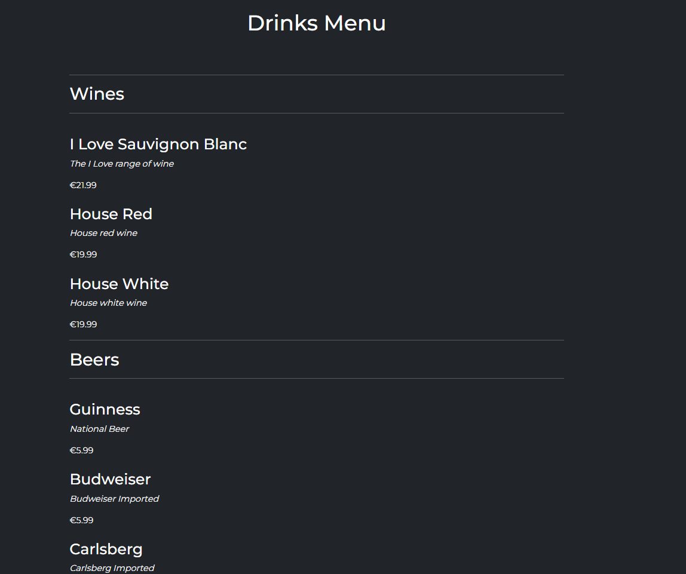

# The Diplomat | Bar & Grill

**Developer: Arron Beale**

💻 [Visit live website](https://ci-pp4-the-diplomat.herokuapp.com/)

## Table of Contents
  - [About](#about)
  - [User Goals](#user-goals)
  - [Site Owner Goals](#site-owner-goals)
  - [User Experience](#user-experience)
  - [User Stories](#user-stories)
  - [Design](#design)
    - [Colours](#colours)
    - [Fonts](#fonts)
    - [Structure](#structure)
      - [Website pages](#website-pages)
      - [Database](#database)
    - [Wireframes](#wireframes)
  - [Technologies Used](#technologies-used)
  - [Features](#features)
  - [Validation](#validation)
  - [Testing](#testing)
    - [Manual testing](#manual-testing)
    - [Automated testing](#automated-testing)
    - [tests on various devices](#tests-on-various-devices)
    - [Browser compatibility](#browser-compatibility)
  - [Bugs](#bugs)
  - [Heroku Deployment](#heroku-deployment)
  - [Credits](#credits)
  - [Acknowledgements](#acknowledgements)

### About

The Diplomat Bar & Grill is a fictional business where users can create an account, book a table, read a blog and view the food and drinks menu.

### User Goals

- To create a table booking
- To be able to view edit and cancel bookings
- To view menus, a blog and contact info

### Site Owner Goals

- To provide a solution to allow users to book a table online
- To attract more business with a well crafted site
- Provide a modern application with an easy navigation
- Fully responsive and accessible

## User Experience

### Target Audience
- Users that wish to book a table for a meal or a party with family and friends
- Past and new customers for the business
- Tourists visiting the area that are looking for a meal or a drink or both
- Fans visiting the area for a sports event or a music concert
- People employed in the area to eat and drink after work

### User Requirements and Expectations

- Fully responsive
- Accessible
- A welcoming design
- Social media
- Contact information
- Accessibility

##### Back to [top](#table-of-contents)

## User Stories

### Users

1.	As a User I can navigate across the site so that I can move to each feature of the site easily (Must have)
2.	As a User I can use a navbar, footer, and social icons so that I can navigate the site, access menus, and access socials (Must have)
3.	As a Site Owner I can provide a contact us page so that users can get in touch with my business (Must have)
4.	As a User I can view the opening hours and contact details so that I know when the business is open and how to contact them via email, phone and socials (Must have)
5.	As a User I can create a booking by selecting a date and time so that I can reserve my table (Must have)
6.	As a User I can update my booking so that I can choose another available time and date (Must have)
7.	As a User I can delete my booking so that I can cancel my table reservation (Must have)
8.	As a user I can view my booking so that I can remind myself of the date and time I have booked (Must have)
14. As a User I can I am notified so that I know my action of creation, edit, or deletion of a booking has been successful (Must have)
15. As a User I can register as prompted so that I can make a booking if I wish reserve a table (Must have)
16. As a User I can register to create an account so that my details are stored for faster booking in future (Must have)
17. As a user I can login so that I can book a table (Must have)
18. As a user I can see my login status so that I know if I am logged in or not (Must have)
19. As an Admin / Authorised User I can toggle booking confirmation to auto or manual mode so that on busy days manual mode can be used to reduce double bookings (Must have)
22. As a User I can view the site's blog so that I can learn additional information and read articles (Should have)
23. As a User I can view the food and drink menu so that I can decide wether to eat at the business (Must have)
25. As a User I can view the food and drink menu so that I can decide wether to eat at the business (Must have)
26. As a User I can not book a date in the past so that my booking is valid (Must have)
27. As a User I can view blog posts page by page so that I can browse without seeing an overloaded page (Should have)
28. As a User I can not book a table already booked so that my booking is valid and not double booked (Must have)

### Admin / Authorised User
9.	As an Admin / Authorised User I can log in so that I can access the back end of the site (Must have)
10.	As an Admin / Authorised User I can manually add a booking so that I can book a table if someone phones, or emails the business (Should have)
11. As an Admin / Authorised User I can accept or reject bookings so that we avoid double bookings (Must have)
12. As an Admin I can login to add or remove items from the food and cocktail menu so that we can add more food and drinks or remove them (Must have)
13.	As a Admin I can create, read, update and delete food and drinks items from the database so that we can add, remove, rename and view all our food and drinks items (Must have)
20. As an Admin / Authorised User I can search through bookings and menus so that I can find the information I am looking for	 (Should have)
21. As an Admin / Authorised User I can filter bookings by date so that I can see what bookings we have for a particular day (Should have)

### Site Owner  
23. As a Site Owner I can provide a fully responsive site for my customers so that they have a good user experience (Must have)
24. As a Site Owner I can validate data entered into my site so that all submitted data is correct to avoid errors (Must have)

##### Back to [top](#table-of-contents)

## Design

### Colours

I chose dark colors to keep a theme of a dimly lit room as seen in a lot of espionage movies.
Dark themes are popular so I wanted to keep the site on a dark theme and not overly bright.

The colors I wanted to stay close to  [Coolors.co](https://coolors.co/)

See colour pallet

### Fonts

 The fonts selected were from Google Fonts, Montserrat wits sans-serif as a backup font.

### Structure

#### Website pages

The site was designed for the user to be familiar with the layout such as a navigation bar along the top of the pages and a hamburger menu button for smaller screen.

The footer contains all relevant social media links that the business has so the user can visit any social media site and follow the business there to expand the businesses followers, likes and shares.

- The site consists of the following pages:
  - Homepage with cards for the user to choose to book a table, view the food or drinks menu.
  - Food menu has the current list of all available foods from the database sorted by starters, mains and desserts
  - Drinks menu has the current list of all available drinks from the databse sorted by type
  - Blog page has a paginated list of blogs posted by an admin or authorised user, 4 per page
  - Blog expanded displays a blog the user has selected so they can read the blog, if they are logged in they can also leave a comment which will then need to be approved before it is displayed
  - Book page allows registered users to book a table , guest count, date requested, time requested and table location
  - My bookings displays all bookings for the user that they have made, bookings in the past are automatically expired
  - Edit booking allows the user to change their date, time, table and guest count
  - Cancel booking allows the user to cancel the booking which will then delete it from the database
  - Contact us allows the user to send us a DM if the are registered, or they can contact us from the displayed email and phone number or visit the address listed.
  - Login / Logout allows users to login to make bookings, view, edit, and delete bookings
  - Register allows the user to regiser so they can use the booking system
  - 404 error page to display if a 404 error is raised

#### Database

- Built with Python and the Django framework with a database of a Postgres for the deployed Heroku version(production)
- Two database model shows all the fields stored in the database

Show diagram

##### User Model
The User Model contains the following:
- user_id
- password
- last_login
- is_superuser
- username
- first_name
- last_name
- email
- is_staff
- is_active
- date_joined

##### FoodItem Model
The User Model contains the following:
- food_id
- food_name
- description
- price
- available

##### DrinkItem Model
The FoodItem Model contains the following:
- drink_id
- drink_name
- description
- price
- available

##### Table Model
The Table Model contains the following:
- table_id (PrimaryKey)
- table_name
- max_seats
- available

##### Booking Model
The Booking Model contains the following:
- booking_id (PrimaryKey)
- created_date
- requested_date
- requested_time
- table (ForeignKey)
- guest (ForeignKey)
- seats
- guest_count

##### Post Model
The Post Model contains the following:
- title
- post_id (PrimaryKey)
- author (ForeignKey)
- created_date
- updated_date
- content
- featured_image
- excerpt
- slug
- status

##### Comment Model
The Comment Model contains the following:
- post (ForeignKey)
- name
- email
- body
- created_date
- approved
- Meta: created_on

##### ContactUs Model
The ContactUs Model contains the following:
- contact_id (PrimaryKey)
- name (ForeignKey)
- email (ForeignKey)
- phone (ForeignKey)
- body

### Wireframes
The wireframes were created using Balsamiq

## Technologies Used

### Languages & Frameworks

- HTML
- CSS
- Javascript
- Python
- Django

### Libraries & Tools

- [Am I Responsive](http://ami.responsivedesign.is/)
- [Balsamiq](https://balsamiq.com/)
- [Bootstrap v5.2](https://getbootstrap.com/)
- [Cloudinary](https://cloudinary.com/)
- [Favicon.io](https://favicon.io)
- [Chrome dev tools](https://developers.google.com/web/tools/chrome-devtools/)
- [Font Awesome](https://fontawesome.com/)
- [Git](https://git-scm.com/)
- [GitHub](https://github.com/)
- [Google Fonts](https://fonts.google.com/)
- [Heroku Platform](https://id.heroku.com/login)
- [jQuery](https://jquery.com)
- [Postgres](https://www.postgresql.org/)
- [Summernote](https://summernote.org/)
- Validation:
  - [WC3 Validator](https://validator.w3.org/)
  - [Jigsaw W3 Validator](https://jigsaw.w3.org/css-validator/)
  - [JShint](https://jshint.com/)
  - [Pycodestyle(PEP8)](https://pypi.org/project/pycodestyle/)
  - [Lighthouse](https://developers.google.com/web/tools/lighthouse/)
  - [Wave Validator](https://wave.webaim.org/)

##### Back to [top](#table-of-contents)

## Features

### Home page
- Home page includes nav bar, main body and a footer

See feature images

### Logo & Navigation
- Custom logo for the business
- Fully Responsive
- On small screens switches to hamburger menu
- Indicates login/logout in status
- displayed on all pages

See feature images

### Footer
- Contains social media links and copyright
- displayed across all pages

See feature images

### Sign up / Register
- Allow users to register an acoount
- Username and password is required, email is optional

See feature images

### Login
- User can login to create a booking, view bookings, edit and delete bookings

See feature images

### Logout
- Allows the user to securely log out
- Ask user if they are sure they want to log out

See feature images

### Book
- Allows the user to book a table using the booking form
- Messages are displayed if the data is not valid such as phone number lenght is too short and the email address is not a valid format

See feature images

### My Bookings
- Allows the user to see all their bookings in a paginated layout, 4 per page
- If the booking is older than today it is automatically expired for the user
- Status of the booking is displayed, awaiting confirmation and when approved will then change to confirmed status for the user

See feature images

### Edit Booking
- Allows the user to edit their booking to another date, time, guest count and table

See feature images

### Cancel Booking 
- Allows the user to cancel their booking, asks user are they sure
  

See feature images

### Food Menu
- The food menu displays all available foods on the menu
- Menu is seperated by starters, mains and desserts
- Items can be added via the admin panel in the backend by staff
- Staff can create, update and delete foods via the admin panel
  

See feature images

### Drinks Menu
- The drinks menu displays all available foods on the menu
- Menu is seperated by wines, beers and cocktails
- Items can be added via the admin panel in the backend by staff
- Staff can create, update and delete foods via the admin panel 
  

See feature images

### Blog
- The blog displays each post made by a staff member
- Paginations is used to display 4 posts per page
  

See feature images

### Blog Expanded
- Expands into the selected blog the user wishes to read
- Displays a featured image uploaded by the poster
- If no image is uploaded a default image is then used
- Registerd user can comment on the blog
  

See feature images

### Comments
- Comments made are set to pending approval status to ensure nothing bad is displayed
- Only registered users can comment on a blog post
- Staff can approve comments via the admin panel on the backend
  

See feature images

### Contact Us
- Registered users can DM staff via the message box
- Contact info such as, phone, email, and address is displayed
- A Google Map is embedded with the address for users to use
  

See feature images

### Social Media Links
- A logo and link is used for each social media displayed
- All links open in a new tab to ensure user is not directed away from the business
- Displayed on all pages
  

See feature images

### Pagination
- Pagination is used on the bookings list and the blog page
- Ensures the page is kept tidy as only 4 items are displayed per page
  

See feature images

##### Back to [top](#table-of-contents)

## Validation

The W3C Markup Validation Service

Home

### CSS Validation
The W3C Jigsaw CSS Validation Service

Style.css

### JavaScript Validation
JSHint JS Validation Service

Script.js

### PEP8 Validation
PEP8 Validation Service was used to check the code for PEP8 requirements via Pycodestyle as PEP8online is currently down

App

File

### Lighthouse

Lighthouse

#### Desktop

View results

#### Mobile

View results

### Wave
WAVE was used to test the websites accessibility.

##### Back to [top](#table-of-contents)

## Testing

1. Manual testing
2. Automated testing

### Manual testing

1. Javascript

**Step** | **Expected Result** | **Actual Result**
------------ | ------------ | ------------ |
 |  | |

### Automated testing

Django unit test

- app, file:

### Device Testing

Site used

- 
- 
- 

### Browser compatibility

- Testing has been carried out on the following browsers:
  - 
  - 
  - 

##### Back to [top](#table-of-contents)

## Bugs

| **Bug** | **Fix** |
| ------- | ------- |
|||

##### Back to [top](#table-of-contents)

### Heroku Deployment
This application has been deployed from GitHub to Heroku by following the steps:

[Official Page](https://devcenter.heroku.com/articles/git) (Ctrl + click)
1. Log in to your account at heroku.com.
2. Create a new app, add a unique app name and choose your region.
3. Click on create app.
4. Go to "Settings".
5. Under Config Vars store any sensitive data in .json file. Name 'Key' field, copy the .json file paste it to 'Value' field. Also add a key 'PORT' and value '8000'.
6. Add required buildpacks. For this project, I set up 'Python' and 'node.js' in that order.
7. Go to "Deploy" and select "GitHub" in "Deployment method"
8. To link up the Heroku app to our Github repository code enter your repository name, click 'Search' and then 'Connect' when it shows below.
9.  Choose the branch you want to buid your app from.
10. If prefered, click on "Enable Automatic Deploys", which keeps the app up to date with your GitHub repository
11. Wait for the app to build. Once ready you will see the “App was successfully deployed” message and a 'View' button to take you to your deployed link.

### Fork Repository
To fork the repository by following these steps:
1. Go to the GitHub repository
2. Click on Fork button in upper right hand corner

### Clone Repository
You can clone the repository by following these steps:
1. Go to the GitHub repository 
2. Locate the Code button above the list of files and click it 
3. Select if you prefere to clone using HTTPS, SSH, or Github CLI and click the copy button to copy the URL to your clipboard
4. Open Git Bash
5. Change the current working directory to the one where you want the cloned directory
6. Type git clone and paste the URL from the clipboard ($ git clone https://github.com/YOUR-USERNAME/YOUR-REPOSITORY)
7.Press Enter to create your local clone.

##### Back to [top](#table-of-contents)

## Credits

- [Bodybuilding.com](https://www.bodybuilding.com/exercises/) & [Regainedwellness](https://www.regainedwellness.com/kneeling-squat/) for description of the exercises used within this app

### Images

Images used were sourced from Pexels.com and an AI image generator (Dalle2) was used for an image with the permission from OpenAI
- 
-
-
-

### Code

- 
- 
- 

##### Back to [top](#table-of-contents)

## Acknowledgements

### Special thanks to the following:
- Code Institute
- 
- 
- 